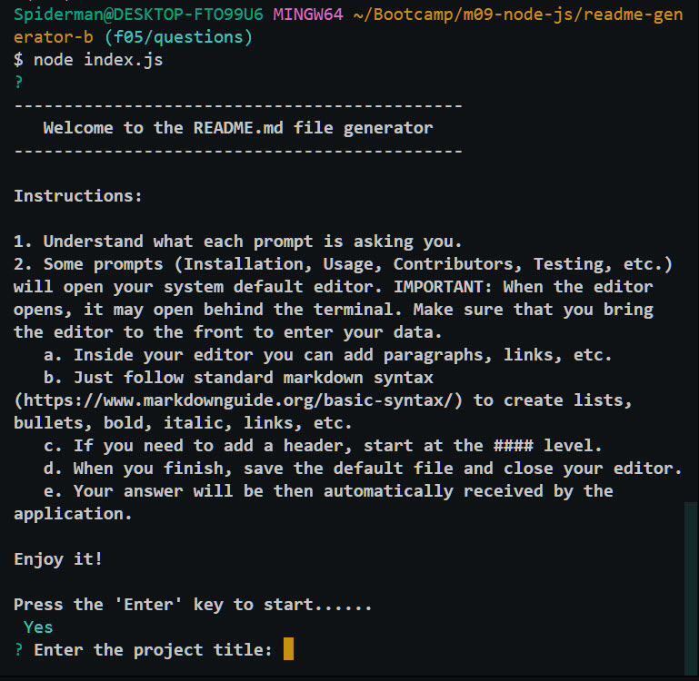

## README.md Generator   
### Description
This application creates a readme.md file at its root directory through prompts generated with the inquirer.js node package.
### Table Of Contents
- [Installation](#installation)
- [Usage](#usage)
- [Contribute](#how-to-contribute)
- [Tests](#tests)
- [License information](#license)
- [Questions](#questions)
- [U of U - Bootcamp](#u-of-u---bootcamp)
### Installation
1. Create your own repo within your Github account.
2. Navigate to this application repo at [README.md Generator](https://github.com/eplp/readme-generator-b). Open the existing README.md file to see what can you accomplish with this application.
3. Download ZIP the code file from the 'main' branch.
4. Navigate to a local directory where you already have git and node installed. If you don't have these tools installed in your local machine, follow the instructions found at [git-scm.com](https://git-scm.com/) and [Node.js](https://nodejs.org/en).
5. Unzip the code file in such way that the extracted folder \readme-generator-b is under your git folder (see above).
6. Open a terminal (VS Code or git bash).
7. Change directory as needed to be inside the 'main' branch.
8. Run the command: 'node init' to install all dependencies associated with the application.
9. Link your local repo to your remote repo. Follow any of the many instruction sets available in the web to accomplish this task. The following link may assist you: [Add existing project to Git](https://gist.github.com/alexpchin/102854243cd066f8b88e).
10. Delete the README.md file from the root directory in your local machine.
11. Start the application by running the comand: 'node index.js'
12. Read the Help instructions displayed at the console/terminal.
13. When the application finishes, stage and commit changes in the local main branch (the README.md and badge.svg files) to your remote repo.
14. Open your remote repo and open the README.md file in the root directory.
15. Congratulations! You got your readme.md file.

### Usage
Watch the video available at [README.md Generator - video](https://github.com/eplp/readme-generator-b/blob/main/assets/images/readme-generator.mp4). When the page appears, click in the **'View raw** link at the center of the page to download it; then use your favorite video player.

### How to contribute
Please follow the inistructions available in GitHub at [Contributing to a project](https://docs.github.com/en/get-started/exploring-projects-on-github/contributing-to-a-project).

### Tests
This application has not implemented any automated testing yet. However, the best way to test it is to use it and see the results. You may want to watch the application usage video shown above.

### License
This work is distributed under the license type: cc0-1.0 / Creative Commons Zero v1.0 Universal. The <a href="https://creativecommons.org/publicdomain/zero/1.0/">Creative Commons CC0 Public Domain Dedication</a> waives copyright interest in a work you've created and dedicates it to the world-wide public domain. Use CC0 to opt out of copyright entirely and ensure your work has the widest reach. As with the Unlicense and typical software licenses, CC0 disclaims warranties. CC0 is very similar to the Unlicense.
### Questions
If you have any questions, visit my GitHub profile page: [github.com/eplp](https://github.com/eplp) or contact me at: [eplp@mail.com](mailto:eplp@mail.com).
### U of U - Bootcamp
- GitHub repo link: [readme-generator-b](https://github.com/eplp/readme-generator-b)
- Deployment/video link: [README.md Generator - video](https://github.com/eplp/readme-generator-b/blob/main/assets/images/readme-generator.mp4). When the page appears, click in the **'View raw'** link at the center of the page to download it; then use your favorite video player.
